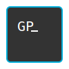

<div align="center">

<h1>
<picture>
  <source media="(prefers-color-scheme: dark)" srcset=".github/gopad_dark.svg">
  <source media="(prefers-color-scheme: light)" srcset=".github/gopad_light.svg">
  
</picture>
</h1>

[](https://goreportcard.com/report/go.gopad.dev/gopad)
[](https://golang.org/doc/devel/release.html)
[](LICENSE)
[](https://github.com/gopad-dev/gopad/actions)
[](https://go.gopad.dev/gopad/releases/latest)

</div>

gopad is a simple terminal-based text editor written in Go. It is inspired mostly by [nano](https://www.nano-editor.org/).

> [!IMPORTANT]
> gopad is still very much wip and not ready for general use.

<details>
<summary>Table of Contents</summary>

- [Installation](#installation)
- [Usage](#usage)
    - [Flags](#flags)
    - [Environment Variables](#environment-variables)
- [Configuration](#configuration)
- [License](#license)

</details>

## Installation

```bash
go install go.gopad.dev/gopad@latest
```

> lol

## Usage

```bash
gopad (--help) (--debug=debug.log) (--pprof=localhost:6060) (--config-dir=config) (--create-config=config) [file | directory]
```

### Flags

All flags are optional.

- `--help` - Show the help message.
- `--debug=debug.log` - Enable debug logging to the specified file.
- `--pprof=localhost:6060` - Enable pprof on the specified address.
- `--config-dir=config` - Use the specified configuration file. (Default: `./.gopad`, `$XDG_CONFIG_HOME/gopad` or `$HOME/.config/gopad`)
- `--create-config=config` - Create a default configuration file at the specified location.

### Environment Variables

- `GOPAD_CONFIG_HOME` - Use the specified directory for configuration files. (Default: `./.gopad`, `$XDG_CONFIG_HOME/gopad` or `$HOME/.config/gopad`)

## Configuration

gopad uses multiple TOML configuration files. See the [default configuration directory](config) for all configuration files.

## License

gopad is licensed under the [Apache License 2.0](LICENSE).
